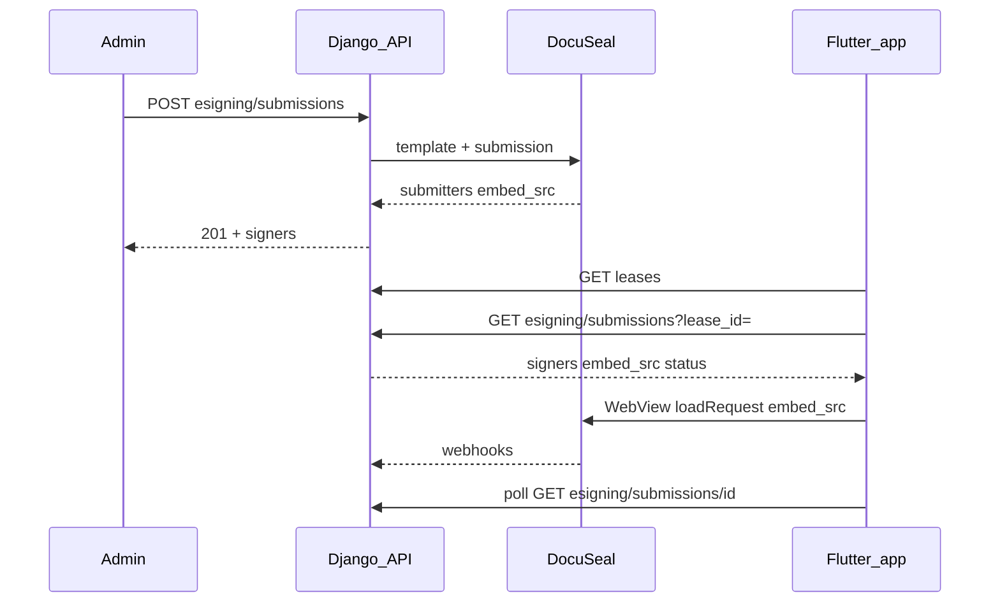

# DocuSeal e-signing — Flutter tenant app integration

This document describes how the **Klikk tenant Flutter app** integrates with Tremly’s e-signing backend and DocuSeal. For the full API model, webhooks, and admin behaviour, see [ESIGNING.md](ESIGNING.md).

## How data flows

1. **Admin (Vue)** — Staff creates a submission from the lease drawer: `POST /api/v1/esigning/submissions/` with `lease_id`, `signing_mode`, and `signers` (see [ESIGNING.md](ESIGNING.md)).
2. **Server** — Generates the lease PDF, uploads a DocuSeal template, creates the submission, stores `ESigningSubmission` with per-signer `embed_src` and statuses.
3. **DocuSeal** — Sends webhooks to `POST /api/v1/esigning/webhook/`; the backend updates submission and signer rows.
4. **Flutter app** — Authenticated **tenant** users list their leases, fetch submissions for a lease, and open the signer’s **`embed_src`** in an in-app **WebView** (not the single-party `data-src` + `data-email` HTML pattern).

## Tenant API access

Tenants use the same JWT-backed `/api/v1` base URL as the rest of the mobile app (`ApiConfig.baseUrl`).

| Action | Method | Path | Notes |
|--------|--------|------|--------|
| List leases | `GET` | `/leases/` | Scoped to the tenant (same as portal). |
| List signing submissions | `GET` | `/esigning/submissions/?lease_id=<id>` | Only submissions for leases the user may access. |
| Submission detail | `GET` | `/esigning/submissions/<id>/` | For polling status while signing. |

Tenants **cannot** `POST` create submissions or `POST` resend; those are **admin/agent** only. Lease used for create must also fall within the agent’s portfolio.

## Flutter codebase map

All paths are under the **`mobile/`** app (package `klikk_tenant`).

| Concern | Location |
|---------|----------|
| API client (Bearer token, refresh) | `lib/services/api_client.dart` |
| Base URL (`/api/v1`, dart-define override) | `lib/config/api_config.dart` |
| Leases list | `lib/services/lease_service.dart` |
| Submission models + `actionableSignerForUser` | `lib/services/esigning_service.dart` |
| Signing hub UI | `lib/screens/esigning/lease_signing_screen.dart` |
| DocuSeal WebView + polling | `lib/screens/esigning/docuseal_webview_screen.dart` |
| Routes `/signing`, `/signing/web` | `lib/router/app_router.dart` |
| Home entry (“Lease signing” card) | `lib/screens/home/home_screen.dart` |
| Dependency | `pubspec.yaml` → `webview_flutter` |
| Unit tests (signer selection logic) | `test/unit/services/esigning_signer_logic_test.dart` |

## UX flow in the app

1. User opens **Home** and taps **Lease signing** → `/signing`.
2. **`LeaseSigningScreen`** loads `GET /leases/`, picks the first **active** lease, otherwise the first lease.
3. It loads `GET /esigning/submissions/?lease_id=<lease.id>`.
4. For each submission, it computes whether the logged-in user may sign using **`actionableSignerForUser`** (matches **account email** to signer `email`, respects **sequential** vs **parallel**).
5. If actionable and `embed_src` is non-empty, **Open signing** navigates to `/signing/web` with `extra: { embedUrl, submissionId }`.
6. **`DocusealWebViewScreen`** calls `WebViewController.loadRequest(Uri.parse(embedUrl))` with JavaScript enabled, and polls `GET /esigning/submissions/<id>/` every **10 seconds** until status is `completed` or `declined`, then pops so the list can refresh.

## Signer selection (sequential vs parallel)

- **Sequential** — Only the **first signer by `order`** who is not `completed` / `declined` / `signed` may sign. If that signer’s email does not match the logged-in user, the tenant sees a waiting state (another party’s turn).
- **Parallel** — Any signer row that is not finished and whose `email` matches the user may open their `embed_src`.

Official DocuSeal Flutter samples use a **template** URL and `data-email` for **single-party** forms only; multi-party flows must go through the **API**, which is what the backend does — see [Embed document signing into Flutter App](https://www.docuseal.com/guides/embed-document-signing-into-flutter-app). Here we load the API-provided **`embed_src`** directly, which supports multiple signers and sequential order.

## Operational requirements

- **Email alignment** — The tenant’s **login email** should match the **signer email** entered in admin when the submission was created; otherwise no **Open signing** action appears.
- **Optional email** — Staff can disable “Send invitation email” per signer in the admin panel when relying on in-app signing.
- **Physical devices** — Point `API_BASE_URL` at a reachable host (see comments in `api_config.dart`).

## Related

- Backend e-signing reference: [ESIGNING.md](ESIGNING.md)
- Vue embedding (future Capacitor/PWA): [Vue document signing](https://www.docuseal.com/vue-document-signing) — same API; prefer `embed_src` in an iframe/WebView if `DocusealForm` expects a different URL shape in your environment.
